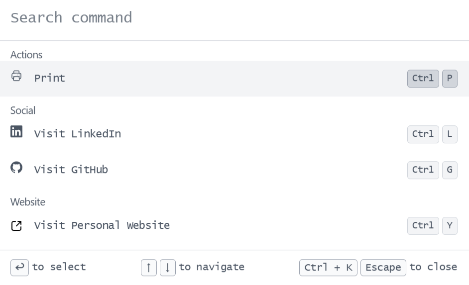

<div align="center">

<h1>
    ASTROLIO: A responsive one-page portfolio template
</h1>
    
<p>
JSON resume schema: <a href="https://jsonresume.org/schema/">jsonresume.org</a>
</p>

<p>
Based on the design of <a href="https://github.com/BartoszJarocki/cv">Bartosz Jarocki</a>
</p>

<p>
Inspired by <a href="https://github.com/midudev/minimalist-portfolio-json">Miguel Ángel Durán</a>
</p>

</div>

<div align="center">
    <a href="#-get-started">
        🚀 Get Started
    </a>
    <span>&nbsp;✦&nbsp;</span>
    <a href="#-site-commands">
        🧞 Site Commands
    </a>
    <span>&nbsp;✦&nbsp;</span>
    <a href="#-license">
        🔑 License
    </a>
    <span>&nbsp;✦&nbsp;</span>
    <a href="https://dakodonnell.com">
        🔗 Author
    </a>
</div>

<p></p>

<div align="center">

[](https://app.netlify.com/sites/astrolio/deploys)


</div>

</img>

## 🗿 Quickstart 
[](https://app.netlify.com/start/deploy?repository=https://github.com/dakodonnell/astrolio)
[](https://vercel.com/new/clone?repository-url=https%3A%2F%2Fgithub.com%2Fdakodonnell%2Fastrolio)


## 🛠️ Stack

- [**Astro**](https://astro.build/) - Web framework.
- [**Typescript**](https://www.typescriptlang.org/) - JavaScript with typed syntax.
- [**Ninja Keys**](https://github.com/ssleptsov/ninja-keys) - Drop-down menu with keyboard shortcuts made in pure Javascript (optional).


## 🚀 Get Started

### 0. Ensure you have the proper dev tools:

- For Astro to run on your system, you will also need to have Node.js installed, version `v18.17.1` or `v20.3.0` or later. (`v19` is not supported.)

```bash
# Check if you already have a compatible version of Node.js installed
node -v
```

- If the command returns a version number higher than `v18.17.1` or `v20.3.0` (excluding any `v19`), you’re good to go!

- If the command returns an error message like `Command 'node' not found`, or a version number lower than the required, then you need to [install a compatible Node.js version.](https://docs.npmjs.com/downloading-and-installing-node-js-and-npm)

### 1. Use this repo as a _template_ for an Astro project:

- Using the command line:
```bash
# Initialize the project
npm create astro@latest -- --template dakodonnell/astrolio
```
- Or, simply clone as a template from Github

### 2. Add your content:
Add your Portfolio/CV to the template
- The file for the printable Portfolio/CV must be named `cv.json` and located in the `src` folder
- The file `cv.json` must follow the JSON Resume [schema](https://jsonresume.org/schema) .
- A sample JSON resume used in the demo is provided in the template repo, which can be edited for your use, or replaced by your own JSON resume
- JSON resumes can be built with the official registry [editor](https://registry.jsonresume.org/editor), but this [toolkit](https://jsoncv.reorx.com) works pretty well too
- Visit https://jsonresume.org/ for more information on JSON resumes

(Helpful tip: Add _isActive_ and _GitHub_ attributes to your projects section in your JSON Resume.)
```
"isActive": true,
"GitHub": "https://github.com/GitHubUsername/GitHubRepo"
```

### 3. Launch the development server:

```bash
# See the result
npm run dev
```

- Open [**http://localhost:4321**](http://localhost:4321/) in your browser to see the result 🚀

- If you wish to deploy your portfolio site to the web, continue to [step 4](#4-push-your-portfolio-to-the-web)

### 4. Push your portfolio to the web:

Connect your portfolio repo to a platform that deploys static web applications ([Netlify](https://netlify.com) or [Vercel](https://vercel.com) are good options)

## 🧞 Site Commands

You can print or save your portolio to PDF by accessing site command palette, which also contains social media and website links from your JSON resume. The menu hotkeys automatically match their respective links.

|      |       |
|------|-------|
| Relevant links are automatically added to the site command palette, accessed with `cmd+k`|  |

## 🔑 License

[MIT](LICENSE.txt) - Go crazy.
